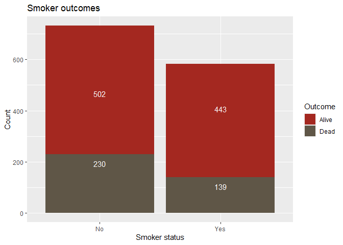

Lab 06b - Simpson’s paradox
================
Lindley Slipetz
3/8/2021

### Load packages and data

``` r
library(tidyverse) 
#install.packages("mosaicData")
#install.packages("wesanderson")
library(mosaicData) 
library(wesanderson)
```

### Exercise 1

``` r
data(Whickham)
```

I think this is an observational study. This is because I highly doubt
they introduced smoking to certain people as an experimental condition
and saw if they died. Instead, I think they observed people who were
already smokers and non-smokers to check their living status.

### Exercise 2

``` r
nrow(Whickham)
```

    ## [1] 1314

There are 1314 observations, which represent individuals.

### Exercise 3

``` r
ncol(Whickham)
```

    ## [1] 3

There are three variables in this dataset: outcome (categorical), smoker
(categorical), and age (discrete because it can only take on integer
values).

For the visualization, I was originally going to do some pie charts for
the categorical variables. After doing some reading, I am now convinced
that pie charts can be difficult to read, so I should use something
easier to compare: a bar graph.

``` r
Whickham %>%
  ggplot(aes(x=outcome, fill = outcome)) +
  geom_bar() +
 scale_fill_manual(values=wes_palette(n=2, name="Darjeeling2"))+
  labs(title = "Outcome counts", x = "Outcome", y = "Count", fill = "Outcome")
```

<!-- -->

``` r
Whickham %>%
  ggplot(aes(x=smoker, fill = smoker)) +
  geom_bar() +
 scale_fill_manual(values=wes_palette(n=2, name="Royal1"))+
  labs(title = "Smoker counts", x = "Smoker status", y = "Count", fill = "Smoker status")
```

<!-- -->

``` r
Whickham %>%
  ggplot(aes(x=factor(age))) +
  geom_bar(stat = "count") +
 scale_fill_manual(values=wes_palette(n=1, name="Royal2"))+
  labs(title = "Age counts", y = "Count") +
  scale_x_discrete("Age", breaks = c(10, 20, 30, 40, 50, 60, 70, 80, 90, 100), labels = c("10", "20", "30", "40", "50", "60", "70", "80", "90", "100"))
```

<!-- -->

### Exercise 4

I would expect there to be a higher mortality for smokers than for
non-smokers.

### Exercise 5

``` r
SM_out_count <- Whickham %>%
  count(smoker, outcome)
```

``` r
tot_a <- 945/1314
tot_a
```

    ## [1] 0.7191781

``` r
tot_d <- 369/1314
tot_d
```

    ## [1] 0.2808219

``` r
a_s <- 443/582
a_s
```

    ## [1] 0.7611684

``` r
d_s <- 139/582
d_s
```

    ## [1] 0.2388316

``` r
a_ns <- 502/732
a_ns
```

    ## [1] 0.6857923

``` r
d_ns <- 230/732
d_ns
```

    ## [1] 0.3142077

About 72% of the sample is alive and 28% of the sample is dead. The
probability of being alive given you’re a smoker is .76, while the
probability of being dead given you’re a smoker is .24. The probability
of being alive given you’re a nonsmoker is .69, while the probability of
being dead given you’re a smoker is .31. This makes it look like you’re
more likely to be dead if you’re a non-smoker. I think this is a clear
case of Simpson’s paradox (i.e., other variables account for the
deaths). Let’s look at a graph.

``` r
Whickham %>%
  ggplot(aes(x=smoker, fill = outcome)) +
  geom_bar(stat="count") +
 scale_fill_manual(values=wes_palette(n=2, name="BottleRocket1"))+
  labs(title = "Smoker outcomes", x = "Smoker status", y = "Count", fill = "Outcome") +
  geom_text(colour = "white", stat='count',  aes(label = ..count..), vjust = 2)
```

<!-- --> I tried for a
long while to get those labels to be percentages instead of counts.
Rather than toiling for hours like I usually do, I gave myself a time
limit to figure it out. I didn’t figure it out within the time limit, so
we’re sticking with counts\!

### Exercise 6

``` r
Whickham <- Whickham %>%
  mutate(age_cat = case_when(
    age <= 44 ~ "18-44",
    age > 44 & age <= 64 ~ "45-64",
    age > 64 ~ "65+"
  ))
```

``` r
Whickham %>%
  ggplot(aes(x=smoker, fill = outcome)) +
  geom_bar(stat="count") +
 scale_fill_manual(values=wes_palette(n=2, name="BottleRocket2"))+
  labs(title = "Smoker outcomes", x = "Smoker status", y = "Count", fill = "Outcome") +
  facet_wrap(.~age_cat)
```

<!-- -->

``` r
Whickham %>%
  count(smoker, age_cat, outcome)
```

    ## # A tibble: 12 x 4
    ##    smoker age_cat outcome     n
    ##    <fct>  <chr>   <fct>   <int>
    ##  1 No     18-44   Alive     327
    ##  2 No     18-44   Dead       12
    ##  3 No     45-64   Alive     147
    ##  4 No     45-64   Dead       53
    ##  5 No     65+     Alive      28
    ##  6 No     65+     Dead      165
    ##  7 Yes    18-44   Alive     270
    ##  8 Yes    18-44   Dead       15
    ##  9 Yes    45-64   Alive     167
    ## 10 Yes    45-64   Dead       80
    ## 11 Yes    65+     Alive       6
    ## 12 Yes    65+     Dead       44

``` r
tot_d_n_18 <- 12/(12+327)
tot_d_n_18
```

    ## [1] 0.03539823

``` r
tot_d_s_18 <- 15/(15+270)
tot_d_s_18
```

    ## [1] 0.05263158

``` r
tot_d_n_45 <- 53/(53+147)
tot_d_n_45
```

    ## [1] 0.265

``` r
tot_d_s_45 <- 80/(80+167)
tot_d_s_45
```

    ## [1] 0.3238866

``` r
tot_d_n_65 <- 165/(28+165)
tot_d_n_65
```

    ## [1] 0.8549223

``` r
tot_d_s_65 <- 44/50
tot_d_s_65
```

    ## [1] 0.88

After looking at the probabilities of being dead in each age group,
there is a higher probability of being dead given that one is a smoker
for each age group. We also see that with the graph. This is an example
of Simpson’s paradox because the inclusion of the age category variable
changes the interpretation of the relationship between smoking status
and outcome.
